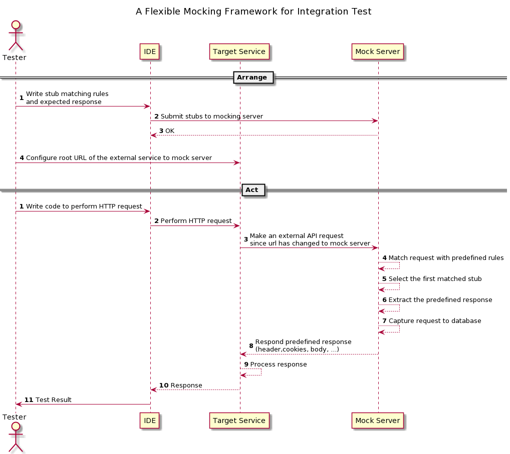

# A lightweight declarative HTTP mocking framework in Golang


[](https://goreportcard.com/report/github.com/hungdv136/rio)
[](https://pkg.go.dev/github.com/hungdv136/rio)

- [A lightweight declarative HTTP mocking framework in Golang](#a-lightweight-declarative-http-mocking-framework-in-golang)
  - [Introduction](#introduction)
  - [Features](#features)
  - [How it works](#how-it-works)
  - [How to use in unit test for Golang](#how-to-use-in-unit-test-for-golang)
    - [Prerequisites](#prerequisites)
    - [Install](#install)
    - [Usage](#usage)
  - [How to use in integration test](#how-to-use-in-integration-test)
    - [Deploy `Rio` as a stand-alone service](#deploy-rio-as-a-stand-alone-service)
    - [Change the root url configuration of the external to mock server](#change-the-root-url-configuration-of-the-external-to-mock-server)
    - [Perform manual test case](#perform-manual-test-case)
    - [Write an automation test cases](#write-an-automation-test-cases)
  - [Request Matching](#request-matching)
    - [Match by method and url](#match-by-method-and-url)
    - [Match by query parameter](#match-by-query-parameter)
    - [Match by cookies](#match-by-cookies)
    - [Match by request body](#match-by-request-body)
      - [JSON Path](#json-path)
      - [XML Path](#xml-path)
      - [Multipart](#multipart)
      - [URL Encoded Form (application/x-www-form-urlencoded)](#url-encoded-form-applicationx-www-form-urlencoded)
    - [Matching Operators](#matching-operators)
  - [Response Definition](#response-definition)
    - [Status Code, Cookies, Header](#status-code-cookies-header)
    - [Response body](#response-body)
      - [JSON](#json)
      - [XML](#xml)
      - [HTML](#html)
      - [Stream/Binary](#streambinary)
    - [Redirection](#redirection)
    - [Reserve proxy and recording](#reserve-proxy-and-recording)
    - [Mock a download API](#mock-a-download-api)
  - [Create stubs using Postman](#create-stubs-using-postman)
    - [JSON Format](#json-format)
    - [YAML](#yaml)
  - [Advance Features](#advance-features)
    - [Support priority response](#support-priority-response)
    - [Delay response](#delay-response)
    - [Deactivate stub when matched](#deactivate-stub-when-matched)
    - [Namespace](#namespace)
    - [Dynamic response](#dynamic-response)
  - [Mocking GRPC](#mocking-grpc)
    - [Define a proto](#define-a-proto)
    - [Define stub](#define-stub)
    - [Mocking GRPC error response](#mocking-grpc-error-response)
    - [Change the root url to rio](#change-the-root-url-to-rio)
  - [How to deploy](#how-to-deploy)
    - [Setup database](#setup-database)
    - [Deploy file storage](#deploy-file-storage)
      - [Use S3](#use-s3)
      - [Use GCS](#use-gcs)
    - [Deploy HTTP mock server](#deploy-http-mock-server)
    - [Deploy GRPC mock server](#deploy-grpc-mock-server)
    - [Configure cache](#configure-cache)
  - [Contribution](#contribution)
    - [Run test](#run-test)
    - [Commit Changes](#commit-changes)

## Introduction

Rio is a declarative HTTP mocking library for unit test in Golang and HTTP/gPRC mock server for integration test. Using the same framework for both kind of tests can help to share stub definition schema or codes between developers and testers easily. This framework has been used for thousands of test cases internally for a long time ago, but it just has been published recently

## Features

- Simple and fluent API for unit test in Golang 
- DSL in YAML/JSON format for stub declarations
- Supports wide-range response types (html, xml, json and binary)
- Can be deployed as mock server (HTTP and gRPC) for integration test
- Supports persistent stubs to database with caching to improve performance
- Flexible for matching request by method, URL params, headers, cookies and bodies
- Dynamic response with go-template
- Automatically generates stubs with reserve proxy mode
- Ability to run tests in parallel to improve speed
- Support SDK in Golang and TypeScript/Javascript

## How it works



## How to use in unit test for Golang

Suppose that we want to test a function that calls API and parse the response data as the following example

```go
func CallAPI(ctx context.Context, rootURL string, input map[string]interface{}) (map[string]interface{}, error) {
	bodyBytes, err := json.Marshal(input)
	if err != nil {
		return nil, err
	}

	req, err := http.NewRequestWithContext(ctx, http.MethodPost, rootURL+"/animal", bytes.NewReader(bodyBytes))
	if err != nil {
		return nil, err
	}

	req.Header.Set("Content-Type", "application/json")
	res, err := http.DefaultClient.Do(req)
	if err != nil {
		return nil, err
	}

	data := map[string]interface{}{}
	decoder := json.NewDecoder(res.Body)
	if err := decoder.Decode(&data); err != nil {
		return nil, err
	}

	return data, nil
}
```

### Prerequisites

Golang 1.18+

### Install

```bash
go get github.com/hungdv136/rio@latest
```

No deployment is required for unit test

### Usage 

Write unit test with Golang

```go 
func TestCallAPI(t *testing.T) {
	t.Parallel()

	ctx := context.Background()
	server := rio.NewLocalServerWithReporter(t)

	t.Run("success", func(t *testing.T) {
		t.Parallel()

		animalName := uuid.NewString()
		returnedBody := map[string]interface{}{"id": uuid.NewString()}

		require.NoError(t, rio.NewStub().
			// Verify method and path
			For("POST", rio.EndWith("/animal")).
			// Verify if the request body is composed correctly
			WithRequestBody(rio.BodyJSONPath("$.name", rio.EqualTo(animalName))).
			// Response with 200 (default) and JSON
      // Body can be map, struct or JSON string
			WillReturn(rio.JSONResponse(returnedBody)).
			// Submit stub to mock server
			Send(ctx, server))

		input := map[string]interface{}{"name": animalName}
		resData, err := CallAPI(ctx, server.GetURL(ctx), input)
		require.NoError(t, err)
		require.Equal(t, returnedBody, resData)
	})

	t.Run("bad_request", func(t *testing.T) {
		t.Parallel()

		animalName := uuid.NewString()

		require.NoError(t, rio.NewStub().
			// Verify method and path
			For("POST", rio.EndWith("/animal")).
			// Verify if the request body is composed correctly
			WithRequestBody(rio.BodyJSONPath("$.name", rio.EqualTo(animalName))).
			// Response with status 400 and empty body JSON
			WillReturn(rio.NewResponse().WithStatusCode(400)).
			// Submit stub to mock server
			Send(ctx, server))

		input := map[string]interface{}{"name": animalName}
		resData, err := CallAPI(ctx, server.GetURL(ctx), input)
		require.Error(t, err)
		require.Empty(t, resData)
	})
}

```

[Examples](https://github.com/hungdv136/rio_examples)

## How to use in integration test

Suppose that we want to test (manual or automation) an API that calls an external API by simulating a mock response for that external API. It can help us to create stable tests by isolating our test suites with external systems

Golang, TypeScript, Postman can be used to define and submit stubs to mock server. [This repository](https://github.com/hungdv136/rio-js) illustrates how to use Rio to write integration tests in Javascript/TypeScript

### Deploy `Rio` as a stand-alone service

See [deploy](#how-to-deploy). After deployed, Rio can be accessed by other services via a domain, for example `http://rio-domain`

### Change the root url configuration of the external to mock server

Go to ENV management system to change the root URL to the mock server with the format: `http://rio-domain/echo` (Must include **`/echo`** at the end)

### Perform manual test case 

1. [Use Postman to submit stubs](#create-stubs-using-postman)
2. Use Postman to perform manual test with your API

### Write an automation test cases

1. Create a new server

This struct is used to connect with the remote server that we have deployed above, so we should provide the root url of that mock server when initializing the remote server struct

```go 
server := rio.NewRemoteServer("http://rio-server")
```

```ts
import { Server } from 'rio-ts-sdk'
server := Server('http://rio-server')
```

2. Define a stub

```go
resData :=types.Map{"data": uuid.NewString(),"verdict": "success"}
stub := rio.NewStub().
		For("GET", rio.Contains("animal/create")).
		WithHeader("X-REQUEST-ID", rio.Contains("<x-request-id>")).
		WithQuery("search_term", rio.EqualTo("<search-value>")).
		WithCookie("SESSION_ID", rio.EqualTo("<cookie-value>")).
		WillReturn(rio.JSONResponse(resData)).
    Send(ctx, server)
```

```ts
import { Stub, Rule, JSONResponse } from 'rio-ts-sdk'

resData :={data: uuidv4(), verdict: "success"};
stub := new Stub("GET", Rule.contains("animal/create"))
  .withHeader("X-REQUEST-ID", Rule.contains('<x-request-id>'))
  .withQuery("search_term", Rule.equalsTo('<search-value>'))
  .withCookie("SESSION_ID", Rule.equalsTo('<cookie-value>'))
  .willReturn(JSONResponse(resData))
  .send(ctx, server);
```

In the above example, the stub will be pushed to remote server via `stub/create_many` API. This should be done before performing a request to the test target service. Since the root url of the external service is switched to `Rio` service, the request will be routed to `Rio` service. Once a request comes, a generic handler in remote server will validate the following information

- Validate method GET
- Validate whether request's path contains `animal/create`
- Validate query string `search_term` whether its value contains a predefined value
- Validate X-Request-ID whether its value equals to a predefined value
- Validate cookie SESSION_ID whether its value equals to a predefined value
- If these conditions are matched, then return with predefined response

## Request Matching

This is to verify incoming requests against predefined stubs. If all rules are matched, then the predefined response of matched stub will be responded

### Match by method and url

```go
NewStub().For("GET", Contains("/helloworld"))
```

```ts
new Stub("GET", Rule.contains("/helloworld"))
```

```json
{
  "request": {
    "method": "GET",
    "url": [{
      "name": "contains",
      "value": "/helloworld"
    }]
  }
}
```

### Match by query parameter

```go
NewStub().WithQuery("search_term", NotEmpty())
```

```ts
new Stub("GET", Rule.contains("/helloworld"))
  .withQuery("search_term", Rule.notEmpty())
```

```json
{
  "request": {
    "query": [{
      "field_name": "search_term",
      "operator": {
        "name": "not_empty"
      }
    }]
  }
}
```

### Match by cookies

```go
NewStub().WithCookie("SESSION_ID", EqualTo("expected cookie value"))
```

```ts
new Stub("GET", Rule.contains("/helloworld"))
  .withCookie("SESSION_ID", Rule.equalsTo("expected cookie value"))
```

```json
{
  "request": {
    "cookie": [{
      "field_name": "SESSION_ID",
      "operator": {
        "name": "equal_to",
        "value": "expected cookie value"
      }
    }]
  }
}
```

### Match by request body

#### JSON Path

```go
NewStub().WithRequestBody(BodyJSONPath("$.name"), NotEmpty())
```

```ts
new Stub('GET', Rule.endWith('/helloworld'))
  .withRequestBody(
    JSONPathRule("$.name", Rule.notEmpty()),
    JSONPathRule("$.count", Rule.equalsTo(3000))
  )
```

```json
{
  "request": {
    "body": [{
      "content_type":  "application/json",
      "operator": {
        "name": "not_empty"
      },
      "key_path": "$.name"
    }] 
  }
}
```

#### XML Path 

```go
NewStub().WithRequestBody(BodyXMLPath("//book/title"), NotEmpty())
```

```json
{
  "request": {
    "body": [{
      "content_type":  "text/xml",
      "operator": {
        "name": "not_empty"
      },
      "key_path": "//book/title"
    }] 
  }
}
```

#### Multipart 

```go
NewStub().WithRequestBody(MultipartForm("field_name"), NotEmpty())
```

```ts
new Stub('GET', Rule.endWith('/helloworld'))
  .withRequestBody(
    MultiPartFormRule("field_name", Rule.notEmpty())
  )
```

```json
{
  "request": {
    "body": [{
      "content_type":  "multipart/form-data",
      "operator": {
        "name": "not_empty"
      },
      "key_path": "field_name"
    }] 
  }
}
```

#### URL Encoded Form (application/x-www-form-urlencoded) 

```go
NewStub().WithRequestBody(URLEncodedBody("CustomerID", EqualTo("352461777")))
```

```ts
new Stub('GET', Rule.endWith('/helloworld'))
  .withRequestBody(
    URLEncodedBodyRule("CustomerID", Rule.equalsTo("352461777"))
  )
```

```json
{
  "request": {
    "body": [{
      "content_type":  "application/x-www-form-urlencoded",
      "operator": {
        "name": "equal_to",
        "value": "352461777"
      },
      "key_path": "CustomerID"
    }] 
  }
}
```

### Matching Operators

See [operator](https://github.com/hungdv136/rio/blob/main/operator.go) for supported operators which can be used for any matching types including method, url, headers. cookies and bodies

| DSL | Golang | TypeScript | Description |
| --- | ------ | ---------- | ----------- |
| contains | rio.Contains | Rule.contains | Checks whether actual value contains given value in parameter |
| not_contains | rio.NotContains | Rule.notContains | Checks whether actual value contains given value in parameter |
| regex | rio.Regex | Rule.regex | Checks whether actual value matches with given regex in parameter |
| equal_to | rio.EqualTo | Rule.equalsTo | Determines if two objects are considered equal. Works as require.Equal |
| start_with | rio.StartWith | Rule.startWith | Tests whether the string begins with prefix. Support string only |
| end_with | rio.EndWith | Rule.endWith | Tests whether the string begins with prefix. Support string only |
| length | rio.Length | Rule.withLength | Checks length of object. Support string or array |
| empty | rio.Empty | Rule.empty | Check whether the specified object is considered empty. Works as require.Empty |
| not_empty | rio.NotEmpty | Rule.notEmpty | Check whether the specified object is considered not empty. Works as require.NotEmpty |

## Response Definition

Response can be defined using fluent functions WithXXX (Header, StatusCode, Cookie, Body) as the following example

```go
rio.NewResponse().WithStatusCode(400).WithHeader("KEY", "VALUE")
```

```ts
new StubResponse().withStatusCode(400).withHeader("KEY", "VALUE")
```

The below are convenient functions to create response with common response content types

```go
// JSON 
rio.JSONReponse(body)

// XML
rio.XMLReponse(body)

// HTML
rio.HTMLReponse(body)
```

```ts
// JSON 
JSONReponse({fieldName: 'value'})

// XML
XMLReponse(`<xml></xml>`)

// HTML
HTMLReponse(`<html></html>`)
```

### Status Code, Cookies, Header

```go
resStub := NewResponse()
  .WithHeader("X-REQUEST-HEADER", "HEADER_VALUE")
  .WithStatusCode(400)
  .WithCookie("KEY", "VALUE")

NewStub().WithReturn(resStub)
```

```ts
resStub := new StubResponse()
  .withHeader("X-REQUEST-HEADER", "HEADER_VALUE")
  .withStatusCode(400)
  .withCookie("KEY", "VALUE")

new Stub('GET', Rule.contains('/path')).withReturn(resStub)
```

```json
{
  "response": {
    "body": {
      "key": "value"
    },
    "cookies": [{
      "name": "SESSION_ID",
      "value": "4e1c0c4d-b7d4-449e-882e-f1be825f1d27",
      "expired_at": "2023-01-07T12:26:01.59694+07:00"
    }],
    "header": {
      "Content-Type": "application/json"
    },
    "status_code": 200
  }
}
```

### Response body

#### JSON

Use JSONResponse to construct response with JSON (parameter can be map or struct)

```go
err := NewStub().For("POST", Contains("animal/create")).
    WillReturn(JSONResponse(types.Map{"id": animalID})).
    Send(ctx, server)
```

```ts
await new Stub("POST", Rule.contains("animal/create"))
  .willReturn(JSONResponse({"id": animalID})).
  .send(server)
```

```json
{
  "response": {
    "status_code": 200,
    "header": {
      "Content-Type": "application/json"
    },
    "body": {
      "key": "value"
    }
  }
}
```

#### XML 

Use XMLResponse to construct response with XML

```go
err := NewStub().For("POST", Contains("animal/create")).
    WillReturn(XMLResponse(structVar)).
    Send(ctx, server)
```

```ts
await new Stub("POST", Rule.contains("animal/create"))
  .willReturn(XMLResponse(`<xml><animal name="bird"/></xml>`)).
  .send(server)
```

```json
{
  "status_code": 200,
  "body": "PGh0bWw+PGh0bWw+",
  "header": {
    "Content-Type": "text/xml"
  }
}
```

With XML data type, content must be encoded to base64 before submit stub as JSON directly to API. If you want to use raw string, submit with YAML format instead. See [YAML](testdata/stubs.yaml) for example

#### HTML

```go
err := NewStub().For("POST", Contains("animal/create")).
    WillReturn(HTMLResponse("<html></html>")).
    Send(ctx, server)
```

```ts
await new Stub("POST", Rule.contains("animal/create"))
  .willReturn(HTMLResponse(`<html> content <html>`)).
  .send(server)
```

```json
{
  "status_code": 200,
  "body": "PGh0bWw+PGh0bWw+",
  "header": {
    "Content-Type": "text/html"
  }
}
```

With HTML data type, content must be encoded to base64 before submit stub as JSON to mokc API. Go and TS SDK handles this out of the box. If you want to use raw string, submit with YAML format instead. See [YAML](testdata/stubs.yaml) for example

#### Stream/Binary

We should upload file to server, then assign file id and appropriate content type to response. This also works for any other response types such as JSON, HTML, XML, ...

```go
server.UploadFile(ctx, fileID, fileBody)
NewStub().WithReturn(NewResponse().WithFileBody(fileID))
```

```ts
const server = Server('http://<mock-server>');
const fileID = await server.uploadFile('/<path/to/file>');

new Stub().withReturn(new StubResponse().withFileBody(fileID))
```

```json
{
  "response": {
    "status_code": 200,
    "body_file": "<file_id>",
    "header": {
      "Content-Type": "<content-type>"
    }
  }
}
```

### Redirection

This is to redirect request to another url

```go
resStub := NewResponse().WithRedirect("https://redirect_url.com")
NewStub().WithReturn(resStub)
```

```ts
resStub := NewResponse().withRedirect("https://redirect_url.com");
new Stub().withReturn(resStub);
```

```json
{
  "response": {
    "status_code": 307,
    "header": {
      "Location": "https://redirect_url.com"
    }
  }
}
```

### Reserve proxy and recording

If we want to communicate with real service and record the request and response, then we can enable recording as the following

- `target_url` is the root url of the real system
- `target_path` is optional. If not provided, then the same relative path from incoming request is used

```go
rio.NewStub().
		ForAny(rio.Contains("reverse_recording/animal/create")).
		WithTargetURL(targetURL).
		WithEnableRecord(true)
```

```ts
new Stub('', Rule.contains("reverse_recording/animal/create"))
  .withTargetURL(targetURL)
  .withEnableRecord(true)
```

```json
{
  "proxy": {
    "target_url": "https://destination",
    "enable_record": true
  }
}
```

The server will create a new inactive stub into database as the recorded result. This is very helpful for the 1st time we want to simulate the response for a service

### Mock a download API

1. Create an appropriate server (local for unit test or remote for integration test)

```go
server := NewRemoteServer("http://mock-server")
```

2. Upload file 

```go
b, err := os.ReadFile(filePath)
require.NoError(t, err)

fileID, err = server.UploadFile()
require.NoError(t, err)
```

We can upload file using rest for integration test `POST {rio-domain}/upload`

3. Create a stub 

```go
resStub := NewResponse().WithFileBody("image/jpeg", fileID)
err := NewStub().For("GET", Contains("animal/image/download")).WillReturn(resStub).Send(ctx, server)
```

```json
{
  "response": {
    "body_file": "<uploaded_file_id",
    "status_code": 200
  }
}
```

4. Perform download request

```go
req := http.NewRequest(http.MethodGet, server.GetURL(ctx)+"/animal/image/download", nil)
res, err := http.DefaultClient.Do(req)
require.NoError(t, err)
require.Equal(t, http.StatusOK, res.StatusCode)
defer res.Body.Close()
// Read response body and assert
```

## Create stubs using Postman

See [Swagger](docs/swagger.yaml) for API specifications

### JSON Format 

The stubs (matching rules and the expected response) can be created through Rest API `stubs/create_many`, the below is example of body payload

```json
{
  "stubs": [
    {
      "active": true,
      "id": 1,
      "namespace": "",
      "request": {
        "body": [
          {
            "content_type":"application/json",
            "key_path": "$.book.type",
             "operator": {
              "name": "equal_to",
              "value": "How to write test in Golang"
            }
          }
        ],
        "cookie": [
          {
            "field_name": "SESSION_ID",
            "operator": {
              "name": "equal_to",
              "value": "27a6c092-3bdc-4f46-b1fb-1c7c5eea39e0"
            }
          }
        ],
        "header": [
          {
            "field_name": "X-REQUEST-ID",
            "operator": {
              "name": "equal_to",
              "value": "f5dcaabc-caac-4c5e-9e06-6b1e935b756d"
            }
          }
        ],
        "method": "GET",
        "query": [
          {
            "field_name": "search_term",
            "operator": {
              "name": "equal_to",
              "value": "4e1c0c4d-b7d4-449e-882e-f1be825f1d27"
            }
          }
        ],
        "url": [
          {
            "name": "contains",
            "value": "animal/create"
          }
        ]
      },
      "response": {
        "body": {
          "key": "value"
        },
        "body_file": "",
        "cookies": [{
          "name": "SESSION_ID",
          "value": "4e1c0c4d-b7d4-449e-882e-f1be825f1d27",
          "expired_at": "2023-01-07T12:26:01.59694+07:00"
        }],
        "header": {
          "Content-Type": "application/json"
        },
        "status_code": 200
      },
      "settings": {
        "deactivate_when_matched": false,
        "delay_duration": 0
      },
      "weight": 0
    }
  ]
}
```

### YAML 

If the response body is not JSON such as XML, or HTML. It is hard to use submit stub with JSON format since JSON does not support multiple lines. In that case, we should use YAML as the following example. Remember to add `Content-Type=application/x-yaml` (This is header of submit request, it is not header of the expected response)

```yaml
stubs:
  - active: true
    namespace: ""
    request:
      body:
        - content_type: application/json
          key_path: $.book.type
          operator:
            name: equal_to
            value: How to write test in Golang
      cookie:
        - field_name: SESSION_ID
          operator:
            name: equal_to
            value: 27a6c092-3bdc-4f46-b1fb-1c7c5eea39e0
      header:
        - field_name: X-REQUEST-ID
          operator:
            name: equal_to
            value: f5dcaabc-caac-4c5e-9e06-6b1e935b756d
      method: GET
      query:
        - field_name: search_term
          operator:
            name: equal_to
            value: 4e1c0c4d-b7d4-449e-882e-f1be825f1d27
      url:
        - name: contains
          value: animal/create
    response:
      template:
        status_code: 200
        header: 
          Content-Type: text/html
        body: >
            <html>
              This is HTML body type
            </html>
    settings:
      deactivate_when_matched: false
      delay_duration: 0s
    weight: 0
```

## Advance Features

All these features are supported in Go and TypeScript SDK with the same function names

### Support priority response

Sometimes, we want the server to return a fallback response if there is no stub are fully matched with the expectation. In this case, we should submit two different stubs to the mock server. Rio will get the stub with highest weight first, if the weight is not specified, the latest stub will be used

```go
highPriority := rio.NewStub().
    For("GET", rio.Contains("animal/create")).
    WithHeader("X-REQUEST-ID", rio.Contains(uuid.NewString())).
    WithQuery("search_term", rio.EqualTo(uuid.NewString())).
    WithCookie("SESSION_ID", rio.EqualTo(uuid.NewString())).
    WithWeight(10).
    WillReturn(rio.NewResponse().WithBody(rio.MapToJSON(resData))).
    Send(server)

lowPriority := NewStub().
    For("GET", Contains("animal/image/download")).
    WithWeight(1).
    WillReturn(resStub).
    Send(ctx, server)
```

```json
{
   "weight": 10
}
```

### Delay response

It is sometimes we want to simulate slow response API. Rio supports this feature by set delay duration

```go
NewStub().For("GET", Contains("animal/create")).ShouldDelay(3 * time.Second)
```

```ts
new Stub("GET", Rule.contains("animal/create")).shouldDelay(3000)
```

```json
{
  "settings": {
    "delay_duration": "3000000000"
  }
}
```

### Deactivate stub when matched

This is to disable the matched stub, it is not used for the next request. In the following example, the first request will return the first stub with higher weight, then that stub is not available for the next request anymore

```go
NewStub().For("GET", Contains("animal/create")).ShouldDeactivateWhenMatched().WithWeight(2)
NewStub().For("GET", Contains("animal/create")).ShouldDeactivateWhenMatched().WithWeight(1)
```

```json
{
  "settings": {
    "deactivate_when_matched": true
  }
}
```

### Namespace

The namespace can be used to separate data between test case. This is helpful when a single mock server is used for many features and projects. Use this pattern as the root url `http://rio.mock.com/<namespace>/echo`. For example, we want to separate test stubs for payment_service and lead service, then set the root url for those service as below

- Payment Service Root URL: `http://rio.mock.com/payment_service/echo`
  
- Lead Service Root URL: `http://rio.mock.com/lead_service/echo`
   
If this url is used `http://rio.mock.com.com/echo`, then default namespace (empty) will be used

### Dynamic response

The dynamic response uses the Go template to generate the response body programatically. The template is a string in YAML format as the following example. Since the JSON does not support multiple lines input, we should submit stubs in YAML format by providing the request body as the following example. Also, we should set the `Content-Type` header to `application/x-yaml`

**Notes:** While this is a powerful feature, we don't recommend to use this feature in the unit test and automation integration test. Because, it is more flexible and easier to debug when building the response using native language that we use to write the test. This template should use for manual test only

For supported function in Go template, see http://masterminds.github.io/sprig/

**Avaliable Variables**

- [Request](https://pkg.go.dev/net/http#Request), can be access as `{{ .Request.<Go-Field-Name> }}`
- `JSONBody` is parsed body in JSON format, can be used in go template as `{{ .JSONBody.<json_field_parent>.<json_field_child> }}`

```yaml
stubs:
  - active: true
    namespace: ""
    request:
      body:
        - content_type: application/json
          key_path: $.book.type
          operator:
            name: equal_to
            value: How to write test in Golang
      cookie:
        - field_name: SESSION_ID
          operator:
            name: equal_to
            value: 27a6c092-3bdc-4f46-b1fb-1c7c5eea39e0
      header:
        - field_name: X-REQUEST-ID
          operator:
            name: equal_to
            value: f5dcaabc-caac-4c5e-9e06-6b1e935b756d
      method: GET
      query:
        - field_name: search_term
          operator:
            name: equal_to
            value: 4e1c0c4d-b7d4-449e-882e-f1be825f1d27
      url:
        - name: contains
          value: animal/create
    response:
      template:
        script_schema_type: yaml
        script: >
            status_code: 200
            
            cookies: 
                {{ range $cookie := .Request.Cookies }}
                - name: {{ $cookie.Name }}
                  value: {{ $cookie.Value }}
                {{end}}

            headers:
                X-REQUEST-ID: {{ .Request.Header.Get "X-REQUEST-ID"}} 
            
            body: >
                {
                    "encrypted_value": "{{ encryptAES "e09b3cc3b4943e2558d1882c9ef999eb" .JSONBody.naked_value}}"
                }
    settings:
      deactivate_when_matched: false
      delay_duration: 0s
    weight: 0
```

Example for template in TypeScript [this file](https://github.com/hungdv136/rio-js/blob/main/example/sdk-install.test.ts)
 
## Mocking GRPC

Mocking grpc is mostly the same as mocking HTTP, the following are some minor differences. Currently, only Unary is supported. Even this gRPC mocking can be used with unit test, we recommend that we should not use it for unit test since it is not right way to do unit test with gPRC

### Define a proto

- Compress protos of a target service and its own proto dependencies into a single compressed file with the same package structure
- Call API `POST proto/upload` to upload compressed file to the rio server. After uploaded proto file, the rest are the same as HTTP mocking

### Define stub

Define stub for grpc the same as for HTTP mock with the following differences

- `method` must be `grpc` as the following example
- `status_code`: Must follow grpc code. Default = 0 for success response. For [details](https://grpc.github.io/grpc/core/md_doc_statuscodes.html)
- `header`: will be matched with request metadata (For example: X-REQUEST-ID)
- `cookie` and `query` are not supported in GRPC

```json
{
  "request": {
    "method": "grpc",
    "url": [{
      "name": "equal_to",
      "value": "/offers.v1.OfferService/ValidateOffer"
    }]
  },
  "response": {
    "status_code": 0,
    "body": {
      "key": "value"
    },
    "header": {
      "Header-Name": "HEADER-VALUE"
    }
  }
}
```

The response body is in JSON format. You can enable proxy with recording or look at the generated proto structure to know the response structure

### Mocking GRPC error response 

```json
{
  "request": {
    "method": "grpc",
    "url": [{
      "name": "equal_to",
      "value": "/offers.v1.OfferService/ValidateOffer"
    }]
  },
  "response": {
    "status_code": 3,
    "error": {
      "message": "This is error message",
      "details": [{
        "type": "common.v1.CommonError",
        "value": {
          "verdict": "record_not_found"
        }
      }]
    }
  }
}
```

`status_code`: Must be greater than 0
`details`: Optional. This is to define detail of error. `type`: must be defined and its proto definitions must be included in the same compressed proto. `value` is a custom key value

### Change the root url to rio

Note that the root does not contains `/echo/` as HTTP mock, also namespace is not supported yet 

## How to deploy

This is to deploy remote mock server. These steps are not required for unit test

### Setup database
  
Supported databases: MySQL or MariaDB

```env
DB_SERVER=0.0.0.0:3306
DB_USER=<user>
DB_PASSWORD=<password>
```

### Deploy file storage 

If LocalStorageType is used then `Rio` can only be deployed with single instance. The GRPC and HTTP services must access to the same directory that is defined in ENV `FILE_DIR`. If we want to deploy Rio as a cluster with multiple instances, then GCS or S3 must be used as file storage

#### Use S3

```env
FILE_STORAGE_TYPE=s3
S3_ACCESS_KEY_ID=
S3_SECRET_ACCESS_KEY=
S3_REGION=ap-southeast-1
```

#### Use GCS

```env
FILE_STORAGE_TYPE=gcs
GCS_CREDENTIALS_FILE=<credential-file-path>
```

### Deploy HTTP mock server

This is required even we want to use GRPC mock only because HTTP server is not only for serving mock requests, but also contains a set of API for submitting stubs

### Deploy GRPC mock server

This is optional. The GRPC is to serve mock GRPC requests. If you just want to use HTTP mock, then can skip this step

### Configure cache 

The below are default configuration for cache. If we want to change cache TTL or change cache strategy, then adjust the following env. Otherwise, can ignore these configurations

```env
STUB_CACHE_TTL=1h
STUB_CACHE_STRATEGY=default
```

The default strategy cache stubs and protos in local memory and invalidate if there is any update/insert/delete in database. If we want to do performance testing, then can change `STUB_CACHE_STRATEGY` to `aside`

- [Docker Compose](docker/compose.yaml): HTTP mock server

- [Docker Compose GRPC](docker/compose.grpc.yaml.yaml): HTTP and gRPC mock servers

## Contribution

### Run test

There are few integration tests in these packages `internal/database`, `internal/api` and `internal/grpc` those are integrated with real database. Follow the following step to setup environment and run tests

1. Install docker

2. Run the below command to setup database for testing

```bash
make dev-up
```

3. Run all tests

```bash
make test
```

4. To cleanup testing environment

```bash
make dev-down
```

### Commit Changes

Run the below command to format codes, check lint and run tests before commit codes

```bash
make all
```
